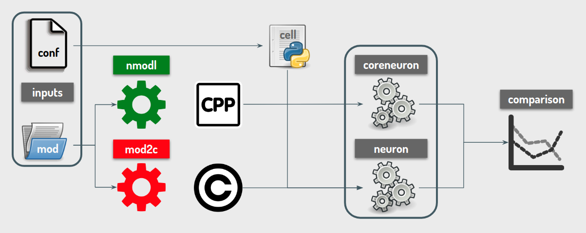

## channel-validation-framework

CVF aims to validate nmodl comparing its results with mod2c traces. The general scheme is presented below:



- `run_config.yaml` is read: this gives us the setups for all the simulators that are going to be tested. Check the
 file for more info.
- For each simulator we compile (in its appropriate `tmp_*` folder) all the mod files (default in `mod/local`; you
 can add folders)
- For each mod file CVF automatically (it is magic!) generates a `config` object that dictates how the simulations
 for that mod file must be done: how many cells, what stimuli, on which cells etc. If you prefer to specify how the
  mod file must be tested you can add a config file in `config/<mod_file_name>.yaml` (it must have the same name as
   the mod file). You can check the other files present in `config/` for inspiration
- Simulations are run and compared (numerically and, possibly, visually)


## Installation

In order to use CVF you need the various neuron and coreneurons that you are going to use (specified in `run_config
.yaml`) installed with spack. For the standard cvf you need to do:

```bash
spack install neuron@develop~mpi
spack install coreneuron@develop~mpi~report ^bison@3.4.2
spack install coreneuron@develop+nmodl~mpi~report ^nmodl@develop ^bison@3.4.2
```

### How to run CVF

CVF can be run in 2 ways:
- Install cvf and run cvf_stdrun to do a standard check
    - Load libraries `module load neuron/develop nmodl/develop`
    - Create a python virtual env `python -m venv venv`
    - Activate it `source venv/bin/activate`
    - Install cvf `python3 setup.py install`
    - Call the standard run `cvf_stdrun`

- SUGGESTED:
    - Load the libraries `module load neuron/develop nmodl/develop`
    - Add your mod files in `mod/local`
    - Modify `run_config.yaml` to set up the various run configurations
    - Run your own python script (check `example.py` for inspirations). The functions exposed to public (in `channel
    -validation-framework/commands`) have python docstring to describe their functionalities


